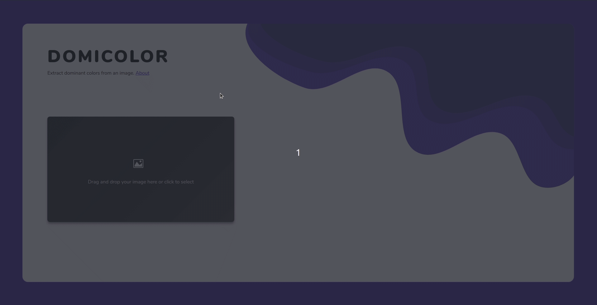

# DomiColor
DomiColor is a web application that **extracts dominant colors from an image** and displays useful information about them.

## Why
I was always aproaching the terminal to run a node script to extract colors from images, and I thought an interface would be lovely. So, I decided to build this.

## Third party libraries used
- [node-vibrant](https://github.com/akfish/node-vibrant/) - extracts the colors.
- [parcel](https://parceljs.org/) - bundles assets.
- [vue.js](https://vuejs.org/) - makes feature addition much faster.

## License
This project is licensed under the MIT License - see the [LICENSE](LICENSE) file for details.

Have a **good** day :)
